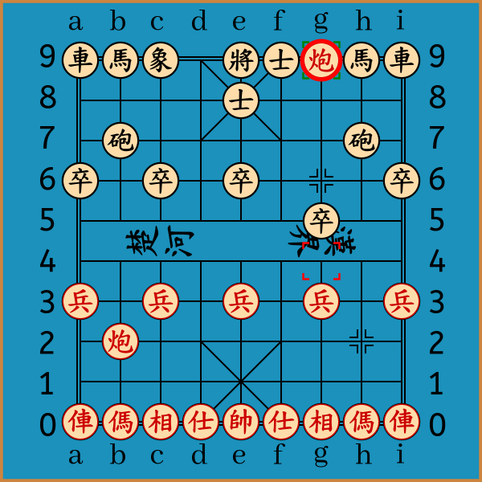
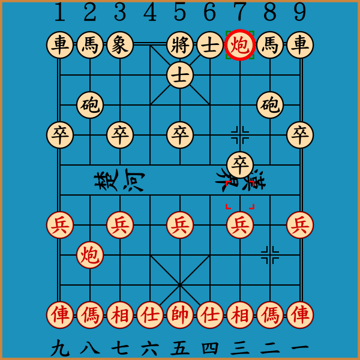
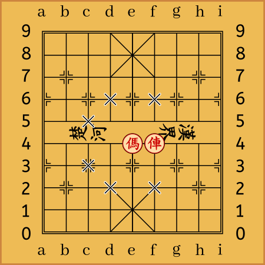
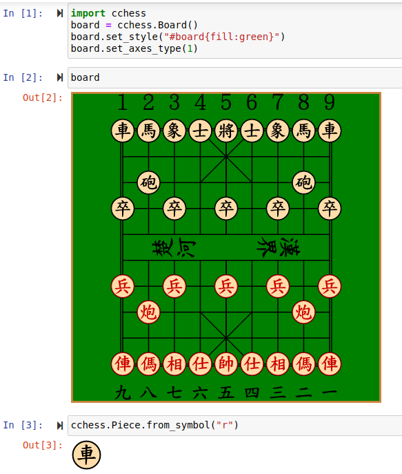
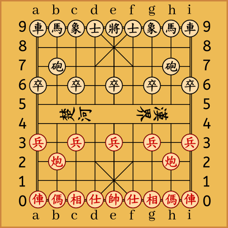

# Python-Chinese-Chess
这是一个使用纯Python编写的中国象棋库，改写自[Python-Chess](https://github.com/niklasf/python-chess)项目的核心部分。


## 特点与说明
- 代码风格与主要功能和[Python-Chess](https://github.com/niklasf/python-chess)项目的核心部分高度相似。
- 适用于Python 3.7及以上的版本，且主要功能不依赖任何第三方库。
- 采用坐标表示法表示棋子位置与着法。
- 实现了传统四字记谱法与坐标表示法的相互转换。
- 采用经典的棋盘与棋子的 svg 代码渲染UI。
- 支持渲染棋局的GIF（需安装一些第三方库）。
- 和棋判断默认采用60步自然限着、3次以上重复局面(允许出现3次)或双方子力均不足以将死对方。
- 由于中国象棋部分规则，例如长将、长捉、闲着等着法的判定尚无统一定论，且十分复杂，因此代码中几乎没有对其进行实现，若实现了会加以说明，但提供了判定循环局面以及将军的接口。
- 对于“子力不足以将死对方”这一强制和棋条件，本项目草率地采用“双方均无能过河的棋子”作为判定方法，因中国象棋残局的变化非常复杂，以鄙人的能力尚不足以对其加以细致的讨论。
## 基本操作
```python
>>> import cchess
>>> import cchess.svg

>>> board = cchess.Board()

>>> board.push(cchess.Move.from_uci("h2h4"))
>>> board.push(cchess.Move.from_uci('d9e8'))
>>> board.push(cchess.Move.from_uci('h4g4'))
>>> board.push(cchess.Move.from_uci('g6g5'))
>>> board.push(cchess.Move.from_uci('g4g9'))

>>> board.is_checkmate()
True

>>> board
Board('rnb1kaCnr/4a4/1c5c1/p1p1p3p/6p2/9/P1P1P1P1P/1C7/9/RNBAKABNR b - - 0 3')

>>> svg = cchess.svg.board(board, size=600, coordinates=True, orientation=cchess.RED, lastmove=board.peek(), checkers=board.checkers())
```

## 安装方法

```shell script
git clone https://github.com/windshadow233/python-chinese-chess.git
```

## 功能

### svg(两种坐标系)棋盘渲染
```python
>>> svg = cchess.svg.board(board,  # 渲染的棋盘
                           size=600,  # 棋盘尺寸
                           coordinates=True,  # 是否显示坐标系
                           axes_type=1,  # 坐标轴类型
                           lastmove=board.peek(),  # 上一步
                           checkers=board.checkers(),  # 将军棋子
                           orientation=cchess.RED,  # 棋盘方向
                           style="#board{fill:#1b91bc}"  # style-sheet
                           )
```
<div align="center">


</div>

- 标记指定点位
```python
>>> board = cchess.Board("9/9/9/9/9/4NR3/9/9/9/9")
>>> cchess.svg.board(board, squares=board.attacks(cchess.E4))
>>> cchess.svg.board(board, squares=board.attacks(cchess.F4))
```

<div align="center">


</div>

- Jupyter Notebook可直接显示棋盘棋子的svg,棋盘可设置坐标类型、自定义CSS

### 行棋、悔棋

```python
>>> board = cchess.Board()
>>> board.push(cchess.Move.from_uci("h2h4"))  # 行一步棋
>>> board.pop()  # 撤销上一步棋
Move.from_uci("h2h4")
```
### 字符串棋盘打印
- ASCII 棋盘
```python
>>> print(board)
r n b a k a b n r
. . . . . . . . .
. c . . . . . c .
p . p . p . p . p
. . . . . . . . .
. . . . . . . . .
P . P . P . P . P
. C . . . . . C .
. . . . . . . . .
R N B A K A B N R
```

- Unicode 棋盘(两种坐标系)
```python
>>> print(board.unicode(axes=True, axes_type=0))
  ａｂｃｄｅｆｇｈｉ
9 車馬象士將士象馬車
8 ．．．．．．．．．
7 ．砲．．．．．砲．
6 卒．卒．卒．卒．卒
5 ．．．．．．．．．
4 ．．．．．．．．．
3 兵．兵．兵．兵．兵
2 ．炮．．．．．炮．
1 ．．．．．．．．．
0 俥傌相仕帥仕相傌俥
  ａｂｃｄｅｆｇｈｉ

>>> print(board.unicode(axes=True, axes_type=1))
１２３４５６７８９
車馬象士將士象馬車
．．．．．．．．．
．砲．．．．．砲．
卒．卒．卒．卒．卒
．．．．．．．．．
．．．．．．．．．
兵．兵．兵．兵．兵
．炮．．．．．炮．
．．．．．．．．．
俥傌相仕帥仕相傌俥
九八七六五四三二一
```
### （伪）合法着法生成、合法性判断
```python
>>> board = cchess.Board()
>>> legal_moves = board.legal_moves
>>> board.legal_moves
<LegalMoveGenerator at ... (i3i4, g3g4, e3e4, c3c4, ...)>
>>> cchess.Move.from_uci("h2h8") in board.legal_moves
False
>>> cchess.Move.from_uci("h2h9") in board.legal_moves
True
>>> board.is_legal(cchess.Move.from_uci("h2h9"))
True

>>> board = cchess.Board('4k3R/2N2n3/5N3/9/9/9/9/9/9/3K5 b')
>>> board.pseudo_legal_moves
<PseudoLegalMoveGenerator at ... (e9f9, e9d9, e9e8, f8h9, f8d9, f8h7, f8d7)>
>>> board.is_pseudo_legal(cchess.Move.from_uci("e9d9"))
True
>>> board.is_legal(cchess.Move.from_uci("e9d9"))
False
```

### 攻击（特殊情况：将军）检测
```python
>>> board= cchess.Board('4k4/2N6/9/9/9/9/9/9/9/3K5 b')
>>> board.is_attacked_by(cchess.RED, cchess.E9)
True
>>> board.is_check()
True
```

### 攻击者检测
```python
>>> board = cchess.Board('4k3R/2N2n3/5N3/9/9/9/9/9/9/3K5 b')
>>> attackers = board.attackers(cchess.RED, cchess.E9)
>>> attackers
SquareSet(0x20004000000000000000000)
>>> print(attackers)
. . . . . . . . 1
. . 1 . . . . . .
. . . . . . . . .
. . . . . . . . .
. . . . . . . . .
. . . . . . . . .
. . . . . . . . .
. . . . . . . . .
. . . . . . . . .
. . . . . . . . .
```

### 终局判断
- 将杀、困毙、子力不足检测
```python
>>> board = cchess.Board('rnb1kaCnr/4a4/1c5c1/p1p1p3p/6p2/9/P1P1P1P1P/1C7/9/RNBAKABNR b - - 0 3')
>>> board.is_checkmate()
True

>>> board = cchess.Board('3k5/R8/9/9/9/9/9/9/9/4K4 b')
>>> board.is_checkmate()
False
>>> board.is_stalemate()
True

>>> board = cchess.Board('2b1k4/9/4b4/9/9/9/9/9/4A4/4KA3')
>>> board.is_insufficient_material()
True
```

- 棋局状态判断
```python
>>> board = cchess.Board('rnb1kaCnr/4a4/1c5c1/p1p1p3p/6p2/9/P1P1P1P1P/1C7/9/RNBAKABNR b - - 0 3')
>>> board.is_game_over()  # 简单判断是否结束
True
>>> board.outcome()  # 棋局的结束状态(若非终局则返回None)
Outcome(termination=<Termination.CHECKMATE: 1>, winner=True)
```

### 局面合法性检验

包含棋子数量、棋子位置、将帅照面等情况
```python
>>> board = cchess.Board('3k5/R8/9/9/9/9/9/9/9/4K4')
>>> board.status()
<Status.VALID: 0>

>>> board = cchess.Board('4k4/9/9/9/9/9/9/9/9/4K4')
>>> board.is_white_face()
True
>>> board.status()
<Status.WHITE_FACE: 268435456>
```

### 单方持续将军检测
单方连续将军三次及以上时，返回True。判定方法比较naive。

**注意**，此操作只检测单方连续将军的次数，故连杀或吃子将军等合法情况也同样会被检测。若需判定一方“长将”，需要结合Board.is_repetition()方法。
```python
>>> board = cchess.Board("5r3/9/5k3/9/5N3/9/5c3/9/5K3/9")
>>> board.push_uci("f5d6")  # 将军
>>> board.push_uci("f7e7")
>>> board.push_uci("d6f5")  # 将军
>>> board.push_uci("e7f7")
>>> board.push_uci("f5d6")  # 连续将军三次
>>> board.is_long_check()
True

>>> board = cchess.Board("5c3/9/5k3/9/5N3/9/5c3/9/5K3/9")
>>> board.push_uci("f5d6")  # 将军
>>> board.push_uci("f7e7")  # 解将还将
>>> board.push_uci("d6f5")  # 将军
>>> board.push_uci("e7f7")
>>> board.push_uci("f5d6")  # 连续将军三次
>>> board.is_long_check()  # 此时判定为False
False
```

### 重复局面检测
```python
>>> board.is_fourfold_repetition()  # 一般比赛规定出现四次重复即不变作和
False
>>> n = 7
>>> board.is_repetition(n)  # 也可以根据情况任意指定不变作和需要达到的重复次数
False
```

### 自然限着检测
```python
>>> board.is_sixty_moves()  # 一般比赛规定60回合为自然限着数
False
>>> n = 75
>>> board.is_halfmoves(2 * n)  # 也可以根据情况任意指定限着数
False
```

### 四字记谱法

#### 四字记谱法说明：

以棋子对应的Unicode字符（中文汉字）指明棋子类别，红黑方分别以中文数字“一～九”、阿拉伯数字“1～9”作为纵坐标，例如“炮二”表示二路红炮、“馬8”表示8路黑马。

第三字为“进”、“退”或“平”，第四字为一个数字（红方为汉字数字“一～九”，黑方为阿拉伯数字“1～9”），其中，只有“俥（車）”、“炮（砲）”、“兵（卒）”、“帥（將）”可以使用“平”，表示横向的移动，此时第四字表示移动到的列坐标，例如“車2平4”表示2路黑车平到4路、“炮二平五”表示二路红炮平到五路。
如第三字为“进”、“退”，第四字根据棋子类别具有不同的意义，若为“俥（車）”、“炮（砲）”、“兵（卒）”、“帥（將）”，则表示其在同一纵线上行走的步数，例如“帥五进一”表示五路红方将领前进一步、“炮2进1”表示2路黑炮前进一步；若为“傌（馬）”、“相（象）”、“仕（士）”，则第四字为到达的纵线坐标，例如“馬8进7”表示8路黑马前进至7路线、“相三进五”表示三路红相前进至五路线。

两个相同的“俥（車）”、“傌（馬）”、“炮（砲）”、“兵（卒）”位于同一列的情况，以“前”、“后”区分，如“前車”、“后砲”。

“仕（士）”、“相（象）”即使是两个在同一列的情况，也不需要以“前”、“后”区分，因第三字“进”、“退”足以区分位置。

对于“兵（卒）”，可能存在同一纵线上超过两个的情况，如同一条纵线上存在三个“兵（卒）”，则以“前”、“中”、“后”区分；
如同一纵线上存在四个“兵（卒）”，则以“前”、“二”、“三”、“四”区分；
如同一纵线上存在五个“兵（卒）”，则以“前”、“二”、“三”、“四”、“五”区分。
另外，如同时存在两条纵线上有2或3个“兵（卒）”，则需要加上纵坐标，如“前兵三进一”表示“三”路线的前红兵向前走一步，“中卒2平3”表示“2”路线的中黑卒平到“3”路线。
为维持四字记谱法，上面这种情况下，一般将“兵（卒）”省略，即记为“前三进一”、“中2平3”。

- 传统四字记谱法与现代坐标记谱法的互相转换
```python
>>> board = cchess.Board()
>>> board.move_to_notation(cchess.Move.from_uci("h2e2"))
'炮二平五'
>>> board.move_to_notation(cchess.Move.from_uci("i9i7"))
'車9进2'
>>> board = cchess.Board("4k4/9/9/9/C8/9/C8/9/9/3K5")
>>> board.move_to_notation(cchess.Move.from_uci("a3a4"))
'后炮进一'
>>> board.move_to_notation(cchess.Move.from_uci("a5e5"))
'前炮平五'
>>> board = cchess.Board("4k4/6P2/1P7/1P4P2/1P7/n8/n8/9/9/3K5")
>>> board.move_to_notation(cchess.Move.from_uci("g8h8"))
'前三平二'
>>> board.move_to_notation(cchess.Move.from_uci("b5c5"))
'后八平七'
>>> board.notation_to_move("中八平九")
Move.from_uci('b6a6')
>>> board.notation_to_move("前馬进3")
Move.from_uci('a3c2')
>>> board.notation_to_move("后馬退2")
Move.from_uci('a4b6')
```

- 使用传统四字记谱法进行走子,以开局棋谱“正马三兵对右肋车 黑骑河车”为例
```python
>>> board = cchess.Board()
 
>>> board.push_notation('炮二平五')
Move.from_uci('h2e2')
>>> board.push_notation('砲8平5')
Move.from_uci('h7e7')
>>> board.push_notation('傌二进三')
Move.from_uci('h0g2')
>>> board.push_notation('馬8进7')
Move.from_uci('h9g7')
>>> board.push_notation('俥一平二')
Move.from_uci('i0h0')
>>> board.push_notation('車9进1')
Move.from_uci('i9i8')
>>> board.push_notation('傌八进七')
Move.from_uci('b0c2')
>>> board.push_notation('車9平4')
Move.from_uci('i8d8')
>>> board.push_notation('兵三进一')
Move.from_uci('g3g4')
>>> board.push_notation('車4进4')
Move.from_uci('d8d4')
>>> board.push_notation('俥二进四')
Move.from_uci('h0h4')
>>> board.push_notation('馬2进1')
Move.from_uci('b9a7')
>>> board.push_notation('炮五平四')
Move.from_uci('e2f2')
>>> board.push_notation('砲2平3')
Move.from_uci('b7c7')
>>> board.push_notation('相三进五')
Move.from_uci('g0e2')
>>> board.push_notation('車1平2')
Move.from_uci('a9b9')
>>> board.push_notation('俥九平八')
Move.from_uci('a0b0')
>>> board.push_notation('車2进4')
Move.from_uci('b9b5')
>>> board.push_notation('兵七进一')
Move.from_uci('c3c4')
>>> board.push_notation('車4进1')
Move.from_uci('d4d3')
>>> board.push_notation('傌三进四')
Move.from_uci('g2f4')
>>> board.push_notation('砲5进4')
Move.from_uci('e7e3')
>>> board.push_notation('仕四进五')
Move.from_uci('f0e1')
>>> board.push_notation('車4平3')
Move.from_uci('d3c3')
>>> board.push_notation('兵七进一')
Move.from_uci('c4c5')
>>> board.push_notation('車2平3')
Move.from_uci('b5c5')
>>> board.push_notation('炮八退一')
Move.from_uci('b2b1')
>>> board.push_notation('前車平2')
Move.from_uci('c3b3')
>>> board.push_notation('炮八平七')
Move.from_uci('b1c1')
>>> board.push_notation('車2进3')
Move.from_uci('b3b0')
>>> board.push_notation('炮七进四')
Move.from_uci('c1c5')
>>> board.push_notation('卒3进1')
Move.from_uci('c6c5')
>>> board.push_notation('傌七进五')
Move.from_uci('c2e3')
```
- 传统记谱法棋谱打印
```python
>>> board = cchess.Board()

>>> board.push(cchess.Move.from_uci("h2h4"))
>>> board.push(cchess.Move.from_uci('d9e8'))
>>> board.push(cchess.Move.from_uci('h4g4'))
>>> board.push(cchess.Move.from_uci('g6g5'))
>>> board.push(cchess.Move.from_uci('g4g9'))

>>> print(board.notations(start_fen=cchess.STARTING_FEN))
炮二进二	士4进5
炮二平三	卒7进1
炮三进五
```

- 棋谱GIF渲染,以上面代码中的棋局为例

**使用此功能需要预先安装numpy, pillow, cairosvg, imageio 与 tqdm库**
```python
>>> import cchess.svg
>>> cchess.svg.to_gif(board, "images/board.gif",
                      start_fen=cchess.STARTING_FEN,  # 棋盘初始状态
                      duration=2,  # 每一步的时间间隔
                      orientation=cchess.RED,  # 棋盘方向
                      coordinates=True,  # 是否显示坐标
                      axes_type=1,  # 坐标轴类型
                      lastmove=True,  # 是否显示上一步
                      checkers=True,  # 是否显示将军棋子
                      size=450  # 棋盘尺寸
                      )
```



## 待补充...
