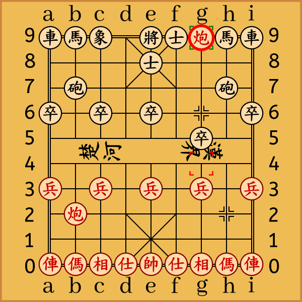

# Python-Chinese-Chess
这是一个使用纯Python编写的中国象棋库，改写自[Python-Chess](https://github.com/niklasf/python-chess)项目的核心部分。

## 基本操作
```python
>>> import chess
>>> import cchess.svg

>>> board = cchess.Board()

>>> board.legal_moves
<LegalMoveGenerator at ... (i3i4, g3g4, e3e4, c3c4, ...)>
>>> cchess.Move.from_uci("h2h8") in board.legal_moves
False
>>> cchess.Move.from_uci("h2h9") in board.legal_moves
True

>>> board.push(cchess.Move.from_uci("h2h4"))
>>> board.push(cchess.Move.from_uci('d9e8'))
>>> board.push(cchess.Move.from_uci('h4g4'))
>>> board.push(cchess.Move.from_uci('g6g5'))
>>> board.push(cchess.Move.from_uci('g4g9'))
>>> svg = cchess.svg.board(board, size=600, orientation=cchess.RED, lastmove=board.peek(), check=board.checkers())

>>> board.is_checkmate()
True

>>> board
Board('rnb1kaCnr/4a4/1c5c1/p1p1p3p/6p2/9/P1P1P1P1P/1C7/9/RNBAKABNR b - - 0 3')

>>> with open('images/board.svg', 'w') as f:
>>>    f.write(svg)
```

## 安装方法

```shell script
git clone https://github.com/windshadow233/cchess.git
```

## 功能

- 简单的 svg 棋盘渲染，可以设置上一步（以四个直角符号包含始末位置）以及将军棋子（以棋子外的红圈示意）的位置。

<div align=center></div>

- 行棋、悔棋

```python
>>> board = cchess.Board()
>>> board.push(cchess.Move.from_uci("h2h4"))  # 行一步棋
>>> board.pop()  # 撤销上一步棋
Move.from_uci("h2h4")
```

- ASCII 棋盘
```python
>>> board = cchess.Board()
>>> print(board)
r n b a k a b n r
. . . . . . . . .
. c . . . . . c .
p . p . p . p . p
. . . . . . . . .
. . . . . . . . .
P . P . P . P . P
. C . . . . . C .
. . . . . . . . .
R N B A K A B N R
```

- Unicode 棋盘
```python
print(board.unicode(axes=True))
  ａｂｃｄｅｆｇｈｉ
9 車馬象士將士象馬車
8 ．．．．．．．．．
7 ．砲．．．．．砲．
6 卒．卒．卒．卒．卒
5 ．．．．．．．．．
4 ．．．．．．．．．
3 兵．兵．兵．兵．兵
2 ．炮．．．．．炮．
1 ．．．．．．．．．
0 俥傌相仕帥仕相傌俥
  ａｂｃｄｅｆｇｈｉ
```

## 待补充...